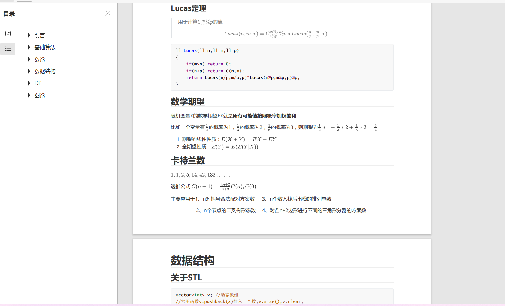

#sky
###写在前面
第一次接触markdown还是以前在学习算法时为了总结学习的知识
然后发现markdown可以十分方便的编辑公式、代码等内容，当时用的还是typora。

###学习git的过程
哇，原来可以这样子，好高级
ohhhhhhh!!!!
但是里面包括的内容真的好多，想在实践中慢慢掌握并运用
###学习markdown的过程
      输入的时候一定不要忘了输入法的中英文切换,555555555
###学习markdown的实践
**加粗**   ctrl+B  *斜体*
图片的插入，先来看只可爱的兔纸


还有神奇的公式们(看b站~~抄~~的)
$$
\lim_{x \to \infin}\frac{sin(t)}{x}=1
$$
表格表格
 | a   | b   | c   |
 | --- | --- | --- |
 | 1   | 2   | 3   |
 | 4   | 5   | 6   |

alt+shift+f 渲染代码中表格，美观

当年最喜欢的代码块功能
```cpp
int main()
{
    \\写一段面试时我的代码
    for(int i=1;i<=100;i++)
    {
        cout<<"中南小团子"<<endl；
    }

    while(a<=100)
    {
        a++;
    }
}
```
然后是自学的python小小写一段语法入门
```python
#这是注释
#整除 //  
# if语句
if num > 60 :
    print("哈哈哈哈哈")
elif num <60:
    print("555555555")
else
    print("666")
# for循环
for animal in ["dog","cat","mouse"]:    #遍历列表
    print("{} is a mammal".format(animal))

for i in range(4)   #打印数字
    print(i)
#while循环
x=0
while x<4
    print(x)
    x+=1
#函数 用def定义新函数

def add(x,y):
    print("x is {} and y is {}".format(x,y))
    return x+y
#调用函数
add(5,6)

```
##链接
就来一段公告上的[链接](https://github.com/ZKluv/54Sher-Coder-Interview/tree/main/example)吧
###进入程序部后想学习的东西

**满怀好奇心,很想探索未知的信息**

  